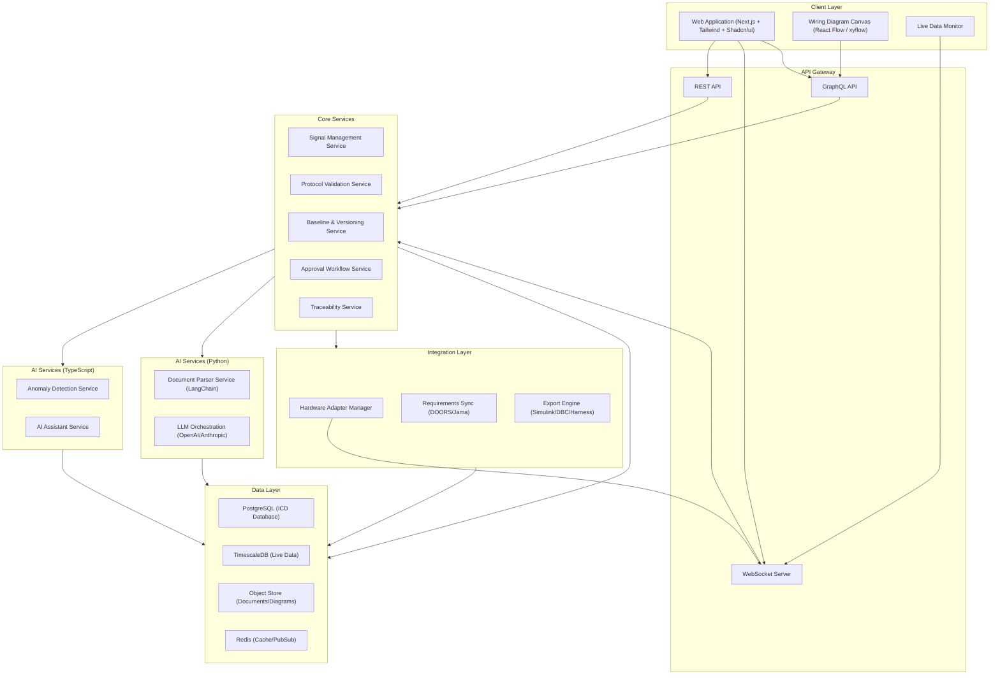
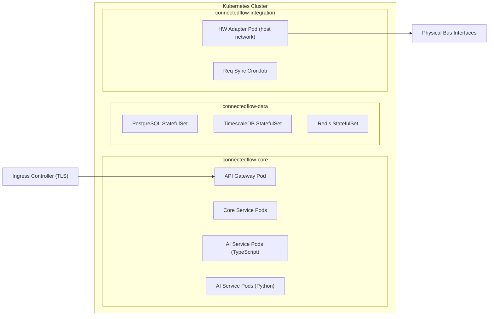
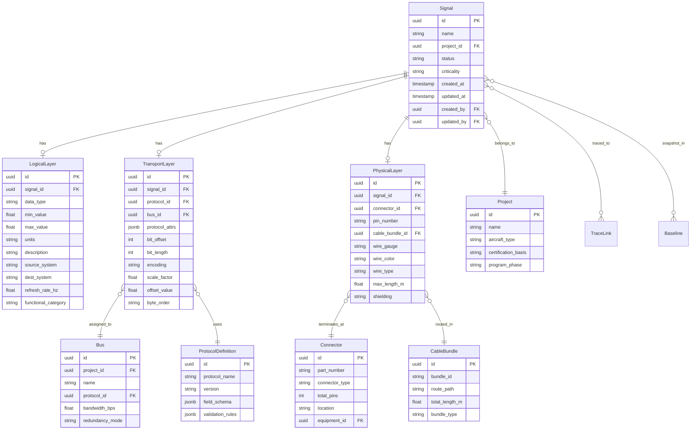
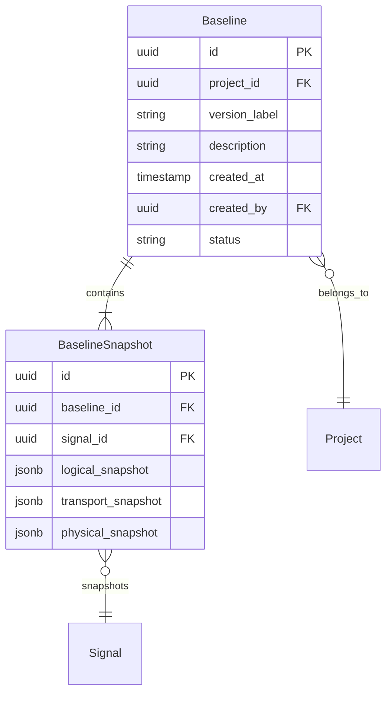
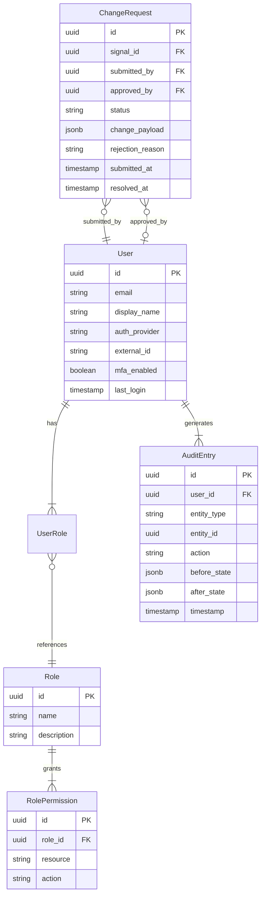

# ConnectedFlow — AI-Driven ICD Management Platform: Technical Design

## Overview

ConnectedFlow is an AI-native Interface Control Document (ICD) management platform designed for aerospace systems integration. It unifies all three ICD layers — logical, transport, and physical — into a single normalized database, replacing the fragmented toolchains (typically 2–4 tools bridged by Excel) that dominate the industry today.

The platform targets eVTOL, Part 23, and Part 25 aircraft programs and provides:

- A unified signal model spanning logical definitions, protocol-specific transport encoding, and physical wiring
- Multi-protocol support: ARINC 429, ARINC 664 (AFDX), CAN bus, MIL-STD-1553
- AI-powered document parsing for legacy ICD onboarding
- Live hardware/simulation connectivity for real-time ICD validation
- AI anomaly detection and intelligent assistant
- Bidirectional integration with upstream (DOORS/Jama) and downstream (Simulink, test bench, harness) tools
- Configuration management with baselining, versioning, and certification-ready exports
- Wiring diagram and EWIS visualization
- Collaborative multi-user environment with RBAC and approval workflows

### Key Design Decisions

| Decision | Rationale |
|---|---|
| Normalized relational DB for ICD data | Referential integrity across three layers is critical; graph or document DBs add complexity without clear benefit for structured signal data |
| Protocol-specific validation as a plugin system | Each avionics protocol has unique field sets and rules; plugins allow adding protocols without core changes |
| AI extraction as a review-before-commit pipeline | Aerospace data requires human verification; fully automated import is unacceptable for certification |
| Event-driven architecture for live data | Hardware adapters produce continuous streams; event-driven decouples ingestion from UI rendering |
| Baseline as immutable snapshots | Certification audits require point-in-time reproducibility; copy-on-write snapshots provide this |
| Next.js (App Router) for web client | SSR for fast initial loads, App Router for modern layouts/streaming, built-in API routes reduce gateway surface area for BFF patterns |
| Tailwind CSS + Shadcn/ui for UI styling | Utility-first CSS enables rapid iteration on a clean, minimal aesthetic (Linear/Figma/Notion-style); Shadcn/ui provides accessible Radix-based primitives without heavy abstraction |
| React Flow (xyflow) for wiring diagrams | Purpose-built node/edge canvas with pan, zoom, minimap, and custom node support — ideal for interactive architecture and wiring visualization |
| Framer Motion for UI animations | Lightweight, declarative animation library for subtle polish (page transitions, micro-interactions) without runtime bloat |
| Python AI service for LLM/ML workloads | LangChain, OpenAI/Anthropic SDKs, and ML ecosystem are Python-native; separating heavy LLM orchestration and document parsing into a Python service avoids awkward TS shims and leverages the strongest tooling |

---

## Architecture

### High-Level Architecture



### Deployment Architecture



The system deploys as a set of containerized services on Kubernetes, supporting both on-premises and private cloud. The hardware adapter pod requires host network access for direct bus interface communication. The Python AI service runs as a separate container alongside the TypeScript services.

---

## Components and Interfaces

### 1. Signal Management Service

Owns the core ICD data model. Handles CRUD operations on signals across all three layers with cross-layer validation.

```typescript
interface SignalService {
  createSignal(input: CreateSignalInput): Promise<Signal>;
  updateSignal(id: SignalId, patch: SignalPatch): Promise<Signal>;
  deleteSignal(id: SignalId): Promise<void>;
  getSignal(id: SignalId): Promise<Signal>;
  querySignals(filter: SignalFilter, pagination: Pagination): Promise<PaginatedResult<Signal>>;
  validateCrossLayer(id: SignalId): Promise<ValidationResult>;
  bulkImport(signals: CreateSignalInput[]): Promise<BulkImportResult>;
}
```

### 2. Protocol Validation Service

Plugin-based architecture for protocol-specific validation. Each protocol registers its field schema and validation rules.

```typescript
interface ProtocolPlugin {
  protocolId: ProtocolId; // e.g., 'arinc429', 'canbus', 'milstd1553', 'arinc664'
  fieldSchema: JSONSchema;
  validate(transportAttrs: Record<string, unknown>): ValidationResult;
  getBusUtilization(busId: BusId): Promise<BusUtilizationReport>;
  migrateFrom(sourceProtocol: ProtocolId, attrs: Record<string, unknown>): MigrationResult;
}

interface ProtocolValidationService {
  registerPlugin(plugin: ProtocolPlugin): void;
  validateTransport(protocolId: ProtocolId, attrs: Record<string, unknown>): ValidationResult;
  getFieldSchema(protocolId: ProtocolId): JSONSchema;
  analyzeBusLoading(busId: BusId): Promise<BusUtilizationReport>;
  migrateProtocol(signalId: SignalId, targetProtocol: ProtocolId): Promise<MigrationResult>;
}
```

### 3. Document Parser Service (AI — Python)

Handles AI-powered extraction from legacy documents using LangChain and LLM APIs (OpenAI/Anthropic). Runs as a separate Python service with a REST API consumed by the TypeScript core services. Operates as a pipeline: upload → extract → review → commit.

```typescript
interface DocumentParserService {
  uploadDocument(file: File, metadata: DocumentMetadata): Promise<ParseJob>;
  getParseJobStatus(jobId: ParseJobId): Promise<ParseJobStatus>;
  getExtractionResults(jobId: ParseJobId): Promise<ExtractionResult>;
  confirmExtraction(jobId: ParseJobId, reviewed: ReviewedExtraction[]): Promise<BulkImportResult>;
  getParsingReport(jobId: ParseJobId): Promise<ParsingReport>;
}

interface ExtractionResult {
  signals: ExtractedSignal[];
  tables: ExtractedTable[];
  unmappedFields: UnmappedField[];
  statistics: ExtractionStatistics;
}

interface ExtractedSignal {
  data: Partial<CreateSignalInput>;
  confidence: number; // 0.0 - 1.0
  sourceLocation: DocumentLocation;
  needsReview: boolean;
}
```

### 4. Anomaly Detection Service (AI)

Runs rule-based and ML-based anomaly detection on ICD modifications.

```typescript
interface AnomalyDetectionService {
  analyzeChange(change: SignalChange): Promise<AnomalyReport>;
  runBulkScan(signalIds: SignalId[]): Promise<AnomalyReport>;
  classifyAnomaly(anomaly: RawAnomaly): ClassifiedAnomaly;
  getSuggestions(anomaly: ClassifiedAnomaly): RemediationSuggestion[];
}

interface ClassifiedAnomaly {
  id: AnomalyId;
  severity: 'error' | 'warning' | 'info';
  category: AnomalyCategory;
  affectedSignals: SignalId[];
  description: string;
  suggestions: RemediationSuggestion[];
}
```

### 5. Baseline & Versioning Service

Manages immutable snapshots of the ICD database for configuration management.

```typescript
interface BaselineService {
  createBaseline(input: CreateBaselineInput): Promise<Baseline>;
  getBaseline(id: BaselineId): Promise<Baseline>;
  listBaselines(filter: BaselineFilter): Promise<PaginatedResult<Baseline>>;
  diffBaselines(baseA: BaselineId, baseB: BaselineId): Promise<BaselineDiff>;
  revertToBaseline(id: BaselineId, reason: string): Promise<RevertResult>;
  exportForCertification(id: BaselineId, standard: CertStandard): Promise<CertExportPackage>;
}

interface BaselineDiff {
  added: Signal[];
  modified: SignalDiffEntry[];
  deleted: Signal[];
  summary: DiffSummary;
}
```

### 6. Hardware Adapter Manager

Manages connections to physical bus interfaces for live data monitoring and simulation.

```typescript
interface HardwareAdapterManager {
  discoverAdapters(): Promise<AdapterInfo[]>;
  connectAdapter(adapterId: AdapterId, config: AdapterConfig): Promise<AdapterConnection>;
  disconnectAdapter(adapterId: AdapterId): Promise<void>;
  startMonitoring(adapterId: AdapterId, channels: ChannelId[]): Promise<MonitorSession>;
  startSimulation(adapterId: AdapterId, stimulus: StimulusConfig): Promise<SimSession>;
  recordSession(sessionId: SessionId): Promise<RecordingHandle>;
}

// Live data flows via WebSocket/event stream
interface LiveDataEvent {
  timestamp: number;
  adapterId: AdapterId;
  channel: ChannelId;
  rawData: Buffer;
  decoded: DecodedParameter[];
  deviations: ParameterDeviation[];
}
```

### 7. Traceability & Integration Service

Manages bidirectional links to requirements tools and exports to downstream tools.

```typescript
interface TraceabilityService {
  linkToRequirement(signalId: SignalId, reqRef: RequirementRef): Promise<TraceLink>;
  unlinkRequirement(linkId: TraceLinkId): Promise<void>;
  getTraceLinks(signalId: SignalId): Promise<TraceLink[]>;
  syncRequirements(source: ReqToolConfig): Promise<SyncResult>;
  onRequirementChanged(callback: (change: ReqChange) => void): void;
}

interface ExportEngine {
  exportTestBenchConfig(signals: SignalId[], format: TestBenchFormat): Promise<ExportFile>;
  exportSimulinkModel(signals: SignalId[]): Promise<ExportFile>;
  exportHarnessDesign(signals: SignalId[], format: HarnessFormat): Promise<ExportFile>;
  exportWireList(signals: SignalId[]): Promise<ExportFile>;
  exportCertPackage(baselineId: BaselineId, standard: CertStandard): Promise<ExportFile>;
}
```

### 8. Approval Workflow Service

Routes ICD changes through configurable approval workflows.

```typescript
interface WorkflowService {
  submitChange(change: SignalChange, submitter: UserId): Promise<ChangeRequest>;
  approveChange(requestId: ChangeRequestId, approver: UserId): Promise<ChangeRequest>;
  rejectChange(requestId: ChangeRequestId, approver: UserId, reason: string): Promise<ChangeRequest>;
  getChangeRequests(filter: ChangeRequestFilter): Promise<PaginatedResult<ChangeRequest>>;
  getAuditTrail(filter: AuditFilter): Promise<PaginatedResult<AuditEntry>>;
}
```

### 9. Wiring Diagram Engine

Generates and renders interactive wiring diagrams from physical-layer ICD data. The interactive canvas uses React Flow (xyflow) for pan, zoom, minimap, and custom node rendering. Framer Motion provides subtle transition animations.

```typescript
interface WiringDiagramEngine {
  generateDiagram(signalIds: SignalId[]): Promise<WiringDiagram>;
  renderToSVG(diagram: WiringDiagram): Promise<string>;
  renderToPDF(diagram: WiringDiagram): Promise<Buffer>;
  getInteractiveView(diagram: WiringDiagram): DiagramViewConfig;
  onPhysicalLayerChange(callback: (change: PhysicalChange) => void): void;
}
```


---

## Data Models

### Core Signal Model (Unified Three-Layer)



### Protocol-Specific Attributes (stored as JSONB in `transport_layer.protocol_attrs`)

**ARINC 429:**
```json
{
  "label": 205,
  "sdi": "00",
  "ssm": "normal",
  "word_type": "BNR",
  "resolution": 0.0054932,
  "bus_speed": "high"
}
```

**CAN Bus:**
```json
{
  "arbitration_id": "0x18FEF100",
  "id_format": "extended_29bit",
  "dlc": 8,
  "cycle_time_ms": 100,
  "start_bit": 0,
  "signal_length": 16
}
```

**MIL-STD-1553:**
```json
{
  "remote_terminal": 5,
  "sub_address": 3,
  "word_count": 4,
  "direction": "RT_to_BC",
  "message_type": "periodic",
  "minor_frame_rate_hz": 80
}
```

**ARINC 664 (AFDX):**
```json
{
  "virtual_link_id": 1024,
  "bag_ms": 32,
  "max_frame_size": 1518,
  "partition_id": "PART_NAV_01",
  "sub_virtual_link": 1,
  "network": "A"
}
```

### Baseline & Versioning Model



### User & RBAC Model



### Traceability Model

```typescript
interface TraceLink {
  id: string;
  signalId: string;
  requirementTool: 'doors' | 'jama';
  externalRequirementId: string;
  requirementText: string;
  linkStatus: 'active' | 'stale' | 'broken';
  lastSyncedAt: Date;
  direction: 'bidirectional';
}
```

### Live Data Model (TimescaleDB)

```sql
CREATE TABLE live_parameter_readings (
    time        TIMESTAMPTZ NOT NULL,
    session_id  UUID NOT NULL,
    signal_id   UUID NOT NULL,
    raw_value   BYTEA,
    decoded_value DOUBLE PRECISION,
    in_range    BOOLEAN,
    deviation_severity TEXT, -- null, 'warning', 'error'
    adapter_id  UUID NOT NULL
);

SELECT create_hypertable('live_parameter_readings', 'time');
```

### AI Extraction Model

```typescript
interface ParseJob {
  id: string;
  documentId: string;
  status: 'queued' | 'processing' | 'review_pending' | 'confirmed' | 'failed';
  extractedSignals: ExtractedSignal[];
  statistics: {
    totalTablesFound: number;
    totalSignalsExtracted: number;
    avgConfidence: number;
    highConfidenceCount: number;
    lowConfidenceCount: number;
    unmappedFieldCount: number;
  };
  createdAt: Date;
  completedAt: Date | null;
}
```


---

## Correctness Properties

*A property is a characteristic or behavior that should hold true across all valid executions of a system — essentially, a formal statement about what the system should do. Properties serve as the bridge between human-readable specifications and machine-verifiable correctness guarantees.*

### Property 1: Signal creation round-trip

*For any* valid signal definition with logical, transport, and physical layer attributes, creating the signal and then querying it by ID should return an equivalent signal with all three layers intact and all attribute values matching the original input.

**Validates: Requirements 1.1, 1.2**

### Property 2: Cross-layer consistency validation

*For any* signal modification that introduces an inconsistency between layers (e.g., a physical wire gauge incompatible with the transport data rate, or a logical range that exceeds the transport encoding capacity), the cross-layer validator should return at least one conflict, and no conflicts should be returned for modifications that maintain consistency.

**Validates: Requirements 1.3**

### Property 3: Import field mapping completeness

*For any* input record containing a mix of fields that match the normalized ICD schema and fields that do not, the import mapper should produce a result where all schema-matching fields are correctly mapped to signal attributes and all non-matching fields appear in the unmapped fields report.

**Validates: Requirements 1.4**

### Property 4: Signal referential integrity on deletion

*For any* signal that has cross-layer links (transport referencing logical, physical referencing transport), attempting to delete the signal should either cascade the deletion across all layers or produce a warning listing all dependent records — the system should never leave orphaned layer records.

**Validates: Requirements 1.5**

### Property 5: Protocol validation correctness

*For any* supported protocol and any set of transport parameters, the protocol validation service should accept parameters that conform to the protocol specification and reject parameters that violate it. Additionally, for any supported protocol, the field schema returned should contain all protocol-specific fields defined in the protocol specification.

**Validates: Requirements 2.1, 2.2**

### Property 6: Protocol migration preserves compatible attributes

*For any* signal with transport layer attributes and any target protocol, migrating the signal should preserve all attributes that are semantically compatible between the source and target protocols, clear all source-protocol-specific attributes that have no target equivalent, and produce a migration result listing what was preserved, cleared, and requires manual review.

**Validates: Requirements 2.3**

### Property 7: Bus bandwidth utilization is additive

*For any* bus with a set of assigned signals, the computed bandwidth utilization should equal the sum of individual signal bandwidth contributions (message size × refresh rate) divided by the bus total bandwidth, and should never exceed 100% without generating a warning.

**Validates: Requirements 2.4**

### Property 8: AI extraction confidence flagging and reporting

*For any* document extraction result, every extracted signal with a confidence score below the configurable threshold should have `needsReview` set to true, and the parsing report should contain accurate statistics (total signals, average confidence, high/low confidence counts, unmapped field count) that are consistent with the actual extraction data.

**Validates: Requirements 3.2, 3.4**

### Property 9: Confirmed extraction creates matching signals

*For any* set of reviewed and confirmed extraction results, the resulting signal records in the database should match the confirmed data — each confirmed extraction should produce exactly one signal with attributes matching the confirmed values.

**Validates: Requirements 3.3**

### Property 10: Live data decoding and deviation detection

*For any* raw bus data frame and corresponding ICD signal definition (with bit offset, length, scale factor, offset, encoding), decoding the raw data should produce a value equal to `(raw_extracted_bits * scale_factor) + offset_value`, and if that decoded value falls outside the signal's logical layer min/max range, the system should flag it as a deviation with appropriate severity.

**Validates: Requirements 4.2, 4.3**

### Property 11: Stimulus generation conforms to ICD definitions

*For any* ICD signal definition, generated stimulus data should produce values within the signal's logical layer defined range, encoded according to the transport layer specification (correct bit position, length, encoding, byte order), and conforming to the protocol's timing constraints.

**Validates: Requirements 4.4**

### Property 12: Live data recording round-trip

*For any* sequence of live data events, recording them and then querying the recorded data for the same session and time range should return all events with matching timestamps, signal IDs, and decoded values.

**Validates: Requirements 4.5**

### Property 13: Anomaly detection and classification completeness

*For any* ICD modification that introduces a known conflict pattern (bus overload, range overlap, encoding mismatch), the anomaly detection service should detect it, classify it with a severity level (error, warning, info), and provide at least one actionable remediation suggestion.

**Validates: Requirements 5.1, 5.2**

### Property 14: Traceability link integrity

*For any* bidirectional trace link between a signal and an upstream requirement, when the upstream requirement changes, the link status should transition to 'stale' and a notification should be generated for the signal owner. When the signal changes, the link should similarly be flagged for review.

**Validates: Requirements 6.1, 6.5**

### Property 15: Export format correctness

*For any* set of signals with complete transport and physical layer data, exporting to any supported format (CAN DBC, ARINC 429 label table, Simulink model, wire list) should produce a file that: (a) is parseable by the target format's standard parser, (b) contains definitions for all input signals, and (c) preserves signal attributes (scaling, encoding, pin assignments) accurately.

**Validates: Requirements 6.2, 6.3, 6.4**

### Property 16: Role-based permission enforcement

*For any* user with an assigned role, the user's effective permissions should exactly match the permission set defined for that role. A user with 'viewer' role should be denied write operations, and a user with 'editor' role should be denied approval operations.

**Validates: Requirements 7.1**

### Property 17: Concurrent edit conflict detection

*For any* signal and any two distinct modifications submitted concurrently (same base version), the system should detect the conflict and prevent silent overwrites — either rejecting the second write or presenting both versions for merge resolution.

**Validates: Requirements 7.2**

### Property 18: Approval workflow routing correctness

*For any* change request, the workflow routing should match the configured rules: changes to signals with 'critical' criticality should require approver-role approval, and the routing decision should be deterministic given the same criticality and role inputs.

**Validates: Requirements 7.3**

### Property 19: Audit trail completeness

*For any* sequence of N distinct signal modifications, the audit trail should contain exactly N entries, each with a valid user ID, timestamp, entity reference, action type, and before/after state snapshots. The entries should be ordered by timestamp.

**Validates: Requirements 7.4**

### Property 20: Baseline snapshot and revert round-trip

*For any* ICD database state, creating a baseline, making arbitrary modifications, and then reverting to that baseline should restore the database to a state identical to the original snapshot. The revert action itself should appear in the audit trail.

**Validates: Requirements 8.1, 8.3**

### Property 21: Baseline diff correctness

*For any* two baselines where the differences are known (specific signals added, modified, or deleted between them), the diff report should correctly identify all additions, modifications, and deletions with accurate before/after values for modified signals.

**Validates: Requirements 8.2**

### Property 22: Certification export completeness

*For any* baseline with trace links to requirements, the certification export should contain a traceability matrix that covers every signal-to-requirement link, and a change history that includes every modification between the baseline and its predecessor.

**Validates: Requirements 8.4**

### Property 23: Wiring diagram reflects physical layer state

*For any* set of signals with physical layer data, the generated wiring diagram should contain a visual element for every unique connector, pin assignment, and cable bundle referenced by those signals. After any physical layer modification, regenerating the diagram should reflect the updated state.

**Validates: Requirements 9.1, 9.3**

### Property 24: Wiring diagram export format validity

*For any* wiring diagram, exporting to SVG should produce a well-formed SVG document, and exporting to PDF should produce a valid PDF file. Both formats should contain visual representations of all connectors and wire runs present in the diagram model.

**Validates: Requirements 9.4**

### Property 25: Startup configuration validation

*For any* system configuration (valid or invalid), the startup validator should report 'ready' only when all required services (database, AI service, adapter manager) are reachable and correctly configured, and should report specific failure reasons for any unreachable or misconfigured service.

**Validates: Requirements 10.5**

---

## Error Handling

### Error Categories and Strategies

| Category | Examples | Strategy |
|---|---|---|
| Validation Errors | Invalid protocol params, out-of-range values, schema violations | Return structured validation result with field-level errors; do not persist invalid data |
| Cross-Layer Conflicts | Wire gauge incompatible with data rate, encoding overflow | Flag as anomaly with severity; allow save with warning, block save on error-severity |
| Concurrent Edit Conflicts | Two users modify same signal | Optimistic locking with version field; detect conflict on save, present merge UI |
| Import/Parse Errors | Unmappable fields, low-confidence extraction, corrupt documents | Quarantine problematic records; present for human review; never auto-commit uncertain data |
| Hardware Adapter Errors | Adapter disconnected, bus error, timeout | Graceful degradation; mark session as interrupted; preserve recorded data up to failure point |
| Integration Errors | DOORS/Jama unreachable, export format generation failure | Retry with exponential backoff for transient errors; queue for retry; notify user of persistent failures |
| Authorization Errors | Insufficient permissions, expired session | Return 403 with specific permission required; redirect to auth on session expiry |
| Baseline Errors | Snapshot too large, revert conflicts with newer data | Async snapshot creation with progress; revert creates new version rather than destructive overwrite |

### Error Response Format

```typescript
interface ErrorResponse {
  code: string;           // Machine-readable error code, e.g., 'VALIDATION_ERROR'
  message: string;        // Human-readable description
  severity: 'error' | 'warning' | 'info';
  details?: {
    field?: string;       // Specific field that caused the error
    constraint?: string;  // Violated constraint
    suggestion?: string;  // Remediation suggestion
  }[];
  correlationId: string;  // For log correlation
}
```

### Resilience Patterns

- **Circuit Breaker**: Applied to external integrations (DOORS, Jama, AI services). Opens after 5 consecutive failures, half-opens after 30s.
- **Retry with Backoff**: Transient failures (network, database locks) retry 3 times with exponential backoff (1s, 2s, 4s).
- **Bulkhead**: Hardware adapter operations isolated from core API; adapter failures don't affect ICD management.
- **Dead Letter Queue**: Failed async operations (exports, syncs) routed to DLQ for manual inspection.

---

## Testing Strategy

### Dual Testing Approach

ConnectedFlow requires both unit tests and property-based tests for comprehensive coverage.

**Unit Tests** focus on:
- Specific examples demonstrating correct behavior (e.g., parsing a known ARINC 429 label)
- Integration points between services (e.g., signal creation triggers anomaly scan)
- Edge cases: empty inputs, boundary values, null layers
- Error conditions: invalid protocols, corrupt documents, permission denied
- AI extraction pipeline state transitions

**Property-Based Tests** focus on:
- Universal properties that hold for all valid inputs (Properties 1–25 above)
- Comprehensive input coverage through randomized generation
- Round-trip properties for data persistence and export
- Invariant properties for validation and consistency

### Property-Based Testing Configuration

- **Library (TypeScript)**: [fast-check](https://github.com/dubzzz/fast-check) for all TypeScript services
- **Library (Python)**: [Hypothesis](https://hypothesis.readthedocs.io/) for the Python AI service
- **Minimum iterations**: 100 per property test
- **Each property test must reference its design property with a tag comment:**
  - TypeScript format: `// Feature: connectedflow-icd-platform, Property {number}: {property_text}`
  - Python format: `# Feature: connectedflow-icd-platform, Property {number}: {property_text}`
- **Each correctness property must be implemented by a single property-based test**

### Frontend Testing

- **Component tests**: Vitest + React Testing Library for Next.js components (Shadcn/ui primitives, signal forms, diagram canvas)
- **E2E tests**: Playwright for full user flows (SSR page loads, wiring diagram interactions via React Flow, approval workflows)
- **Visual regression**: Optional Chromatic/Storybook snapshots for Tailwind + Shadcn/ui component library

### Test Categories

| Category | Type | Coverage Target |
|---|---|---|
| Signal CRUD round-trip | Property | Properties 1, 4 |
| Cross-layer validation | Property | Properties 2, 3 |
| Protocol validation & migration | Property | Properties 5, 6, 7 |
| AI extraction pipeline | Property + Unit | Properties 8, 9 (Python: Hypothesis) |
| Live data decoding | Property | Properties 10, 11, 12 |
| Anomaly detection | Property | Property 13 |
| Traceability & export | Property | Properties 14, 15 |
| RBAC & workflow | Property | Properties 16, 17, 18 |
| Audit trail | Property | Property 19 |
| Baseline management | Property | Properties 20, 21, 22 |
| Wiring diagrams | Property | Properties 23, 24 |
| System startup | Property | Property 25 |
| Hardware adapter discovery | Unit (mock) | Requirement 4.1 |
| SSO/MFA authentication | Integration | Requirements 10.2, 10.3, 10.4 |
| AI assistant responses | Manual/Integration | Requirement 5.3 |
| Bulk operation pre-flight scan | Unit | Requirement 5.4 |
| UI interactions (diagram nav) | E2E (Playwright) | Requirement 9.2 |

### Custom Generators (fast-check Arbitraries)

Key generators needed for property tests:

- `arbSignal()`: Generates valid Signal with all three layers populated
- `arbLogicalLayer()`: Random logical attributes with consistent type/range/units
- `arbTransportLayer(protocol)`: Protocol-specific transport attributes within valid ranges
- `arbPhysicalLayer()`: Random physical attributes with valid wire gauges, pin numbers
- `arbProtocolId()`: One of the supported protocols
- `arbBusData(icdDef)`: Raw bus data that decodes to values within/outside ICD ranges
- `arbExtractionResult()`: Random extraction results with varying confidence scores
- `arbBaseline(signalCount)`: A baseline snapshot with N signals
- `arbChangeRequest(criticality, role)`: Change requests with specific criticality/role combos
