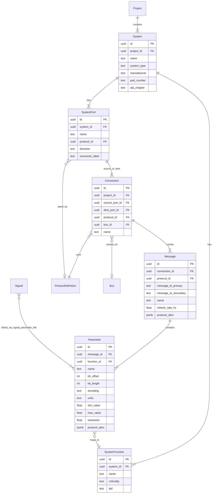

# 3-Level ICD Hierarchy: Technical Design

## Overview

This feature adds a 3-level hierarchical ICD navigation model to ConnectedICD, enabling drill-down from System (LRU) → Connection/Bus → Message/Label → Parameter. The design is informed by analysis of PEERSS/dBricks and advisor feedback.

The architecture uses a **protocol-flexible** approach: one generic engine with declarative JSONB protocol descriptors, rather than hardcoded modules per bus type. Physical ports and logical functions are explicitly separated, following industry best practice.

### Key Design Decisions

| Decision | Rationale |
|---|---|
| Additive migration (no existing tables modified) | Backward compatibility with existing flat signal view; zero-risk deployment |
| Protocol descriptors as JSONB field_schema | New protocols added via data insert, not code; follows dBricks "generic serial" pattern for MIL-1553 |
| Physical/logical separation (ports vs functions) | Same parameter can exist on multiple physical interfaces; same port carries multiple functions' data |
| signal_parameter_link bridge table | Connects legacy signal table to new parameter table without modifying either |
| Protocol-specific columns rendered from field_schema | UI adapts dynamically to any protocol; no hardcoded A429/A825/AFDX forms |

---

## Architecture

### Entity Hierarchy

```
Project
├── System (LRU instance: FCC, ADC, AHRS, BMS)
│   ├── SystemPort (physical: A429_TX_CH1, DISC_OUT_3)
│   └── SystemFunction (logical: Air Data Processing, ILS Nav)
│
├── Connection (port↔port link, with bus type)
│   └── Message (protocol-specific: Label 0310, CAN ID 0x18FF00)
│       └── Parameter (bit-level: AIRSPEED, bits 28-14, BNR)
│           └── mapped to → SystemFunction
│
└── Bus (physical bus instance, carries connections)

Common Objects (shared across projects):
├── ProtocolDefinition (A429, A825, AFDX, MIL-1553, Discrete, Analog)
├── WireType, ConnectorType, DataEncoding, UnitOfMeasure
```

### New Tables (11 total)



### Common Object Tables (4 total)

| Table | Purpose |
|-------|---------|
| `wire_type` | Wire specifications (gauge, material, shielding) |
| `connector_type` | Connector catalog (standard, pin count) |
| `data_encoding` | Encoding types with bit conventions (BNR, BCD, discrete) |
| `unit_of_measure` | Units catalog (name, symbol, quantity type) |

---

## Components and Interfaces

### API Endpoints

```typescript
// System Explorer endpoints
interface SystemExplorerAPI {
  // Level 1: Systems
  'GET /api/systems': (query: { projectId?: string }) => System[];
  'POST /api/systems': (body: CreateSystemInput) => System;
  'GET /api/systems/:id': () => SystemDetail; // includes ports, functions, connection summary

  // Level 1→2: System connections
  'GET /api/systems/:id/connections': () => ConnectionSummary[];

  // Level 2: Messages on a connection
  'GET /api/connections/:id/messages': () => Message[];

  // Level 3: Parameters in a message
  'GET /api/messages/:id/parameters': () => Parameter[];

  // CRUD
  'POST /api/connections': (body: CreateConnectionInput) => Connection;
  'POST /api/messages': (body: CreateMessageInput) => Message;
  'POST /api/parameters': (body: CreateParameterInput) => Parameter;

  // Protocol schemas (for dynamic form rendering)
  'GET /api/protocols': () => ProtocolDefinition[];
}
```

### API Response Types

```typescript
// GET /api/systems
interface SystemListItem {
  id: string;
  name: string;
  system_type: string;
  manufacturer: string;
  part_number: string;
  ata_chapter: string;
  port_count: number;
  connection_count: number;
}

// GET /api/systems/:id
interface SystemDetail {
  id: string;
  name: string;
  system_type: string;
  manufacturer: string;
  part_number: string;
  ata_chapter: string;
  ports: { id: string; name: string; protocol_name: string; direction: string; connector_label: string }[];
  functions: { id: string; name: string; criticality: string; dal: string }[];
}

// GET /api/systems/:id/connections
interface ConnectionSummary {
  id: string;
  name: string;
  remote_system_name: string;   // the "other" system
  remote_system_id: string;
  protocol_name: string;
  protocol_id: string;          // for field_schema lookup
  source_port_name: string;
  dest_port_name: string;
  direction: string;            // 'tx' | 'rx' | 'bidirectional' (relative to selected system)
  message_count: number;
}

// GET /api/connections/:id/messages
interface MessageListItem {
  id: string;
  message_id_primary: string;
  message_id_secondary: string | null;
  name: string;
  direction: string;
  refresh_rate_hz: number | null;
  word_count: number | null;
  protocol_attrs: Record<string, unknown>;  // fields per field_schema
  parameter_count: number;
}

// GET /api/messages/:id/parameters
interface ParameterListItem {
  id: string;
  name: string;
  description: string;
  bit_offset: number;
  bit_length: number;
  encoding: string;
  units: string;
  min_value: number | null;
  max_value: number | null;
  resolution: number | null;
  scale_factor: number;
  offset_value: number;
  byte_order: string;
  ssm_convention: string | null;
  protocol_attrs: Record<string, unknown>;
  function_name: string | null;  // from joined system_function
  criticality: string;
}

// GET /api/protocols
interface ProtocolListItem {
  id: string;
  protocol_name: string;
  version: string;
  field_schema: ProtocolFieldSchema;
  validation_rules: Record<string, unknown>;
}
```

### Protocol Field Schema Structure

Each `protocol_definition.field_schema` declares valid fields for messages and parameters:

```typescript
interface ProtocolFieldSchema {
  message_fields: string[];      // fields valid on message.protocol_attrs
  parameter_fields: string[];    // fields valid on parameter.protocol_attrs
  defaults: Record<string, unknown>; // default values for new messages/parameters
}
```

**Seeded protocols:**

| Protocol | message_fields | parameter_fields |
|----------|---------------|-----------------|
| ARINC 429 | label_number, sdi, word_rate_hz, word_size_bits | bit_position, msb, lsb, encoding, range_min, range_max, resolution, ssm_type, sign_bit |
| ARINC 825 | can_id, dlc, transmission_type, bap_id, node_id | start_bit, length, scale, offset, byte_order, value_type |
| AFDX | vl_id, bag_ms, max_frame_bytes, sub_vl_id, network_id | byte_offset, bit_offset, bit_length, encoding, units |
| MIL-STD-1553 | rt_address, subaddress, word_count, message_type | word_number, bit_position, bit_length, encoding, range_min, range_max |
| Discrete | pin_id, voltage_level, signal_type | state_0_meaning, state_1_meaning, debounce_ms |
| Analog | channel_id, signal_type, excitation | range_min, range_max, accuracy_percent, sample_rate_hz, filtering |

### Frontend: System Explorer Component

```typescript
// Three-panel drill-down view
interface SystemExplorerView {
  // Level 1: System list with search/filter
  SystemList: React.FC<{ projectId: string }>;
  
  // Level 1 detail: Selected system's connections
  SystemDetail: React.FC<{ systemId: string }>;
  
  // Level 2: Messages on selected connection (columns from field_schema)
  MessageList: React.FC<{ connectionId: string; protocol: ProtocolDefinition }>;
  
  // Level 3: Parameters in selected message (columns from field_schema)
  ParameterDetail: React.FC<{ messageId: string; protocol: ProtocolDefinition }>;
  
  // Breadcrumb: Project > System > Connection > Message > Parameter
  Breadcrumb: React.FC<{ path: NavigationPath }>;
}
```

---

## Data Models

### Protocol-Specific Attributes (JSONB examples)

**ARINC 429 Message:**
```json
{
  "label_number": "0310",
  "sdi": "00",
  "word_rate_hz": 12.5,
  "word_size_bits": 32
}
```

**ARINC 429 Parameter:**
```json
{
  "bit_position": 28,
  "msb": 28,
  "lsb": 14,
  "encoding": "BNR",
  "range_min": 0,
  "range_max": 512,
  "resolution": 0.0625,
  "ssm_type": "BNR",
  "sign_bit": true
}
```

**ARINC 825 Message:**
```json
{
  "can_id": "0x18FF0042",
  "dlc": 8,
  "transmission_type": "one_to_many",
  "node_id": "FCC_01"
}
```

**Discrete Message:**
```json
{
  "pin_id": "J1-Pin14",
  "voltage_level": "28V",
  "signal_type": "open_ground"
}
```

---

## Correctness Properties

### Property 1: System hierarchy navigation completeness

*For any* project with systems, ports, connections, messages, and parameters, navigating from the system list through each level should reach every parameter in the database. No parameter should be unreachable from the system explorer.

**Validates: Requirements 1.1, 1.2, 1.3, 1.4**

### Property 2: Protocol schema drives form rendering

*For any* protocol definition with a field_schema, the message and parameter forms should render exactly the fields listed in that schema. Adding a field to field_schema should cause it to appear in the form without code changes.

**Validates: Requirements 2.1, 2.2, 2.3**

### Property 3: Physical/logical independence

*For any* parameter linked to a function and carried on a port, changing the port assignment should not affect the function link, and changing the function assignment should not affect the port/connection/message structure.

**Validates: Requirements 3.1, 3.2, 3.3, 3.4**

### Property 4: Backward compatibility preservation

*For any* existing signal in the signal table, the /api/signals endpoint should return it unchanged after the migration. The new tables should not affect existing table data or query results.

**Validates: Requirements 5.1, 5.2, 5.3, 5.4**

### Property 5: Seed data navigability

*For any* seed data set, every system should be reachable from the system list, every connection from its system, every message from its connection, and every parameter from its message. The drill-down should terminate at parameters with complete bit-level detail.

**Validates: Requirements 6.1, 6.2, 6.3, 6.4**

---

## Error Handling

| Error | Strategy |
|-------|----------|
| Missing protocol_definition for a bus type | Return 400 with "Unknown protocol" and list of valid protocols |
| Invalid protocol_attrs (doesn't match field_schema) | Return 422 with field-level validation errors per validation_rules |
| Duplicate system name in project | Return 409 with "System name already exists in this project" |
| Connection references ports on same system | Return 400 with "Cannot connect a system to itself" |
| Orphaned message (connection deleted) | CASCADE delete messages and parameters |
| Parameter bit_offset + bit_length exceeds protocol word size | Return 422 with "Parameter exceeds word boundary" per validation_rules |

---

## Scope

### v1 (This Implementation)

- Database migration (11 new tables, 6 protocol definitions) ✅ DONE
- API endpoints for systems, connections, messages, parameters
- System Explorer frontend (3-level drill-down)
- Seed data (eVTOL project)
- Protocol-aware dynamic forms

### v2 (Deferred)

- Device Templates (reusable LRU definitions)
- ARINC 653 software partitions (IMA support)
- Bus View (filter by protocol across project)
- LRU Filter View (all interfaces for one system, flattened)
- ICD document export (Word/Excel generation)
- Bus load analysis and signal tracing analytics
- Data validity rules (prevent incompatible bus connections)
